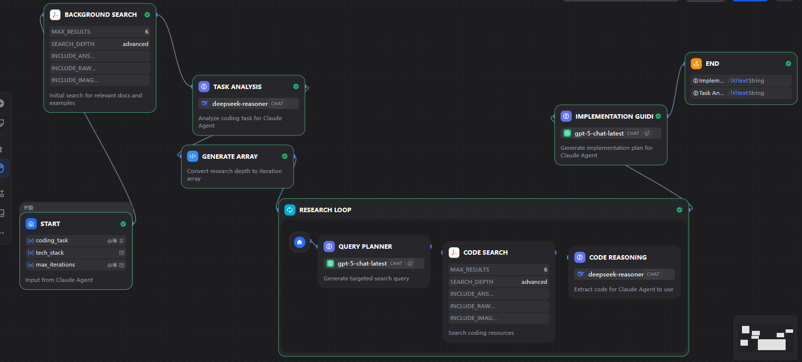

# Terminal Coding Agent

中文 | [English](./README.md)

一个基于 [Claude Agent SDK](https://github.com/anthropics/claude-agent-sdk) 的强大命令行多智能体编程助手。

> **Rust 版本**: [rust-terminal-coding-agent](https://github.com/21pounder/rust-terminal-coding-agent)

<p align="center">
  <a href="https://github.com/yourusername/terminalAgent/releases"></a>
  <a href="https://www.typescriptlang.org/"></a>
  <a href="https://github.com/anthropics/claude-agent-sdk"></a>
  <a href="https://dify.ai"></a>
  <a href="https://playwright.dev"></a>
  <a href="https://nodejs.org"></a>
  <a href="./LICENSE"></a>
</p>

<p align="center">
  
</p>

## 特性

- **多智能体架构** - Coordinator、Reader、Coder、Reviewer 智能体协同工作
- **智能路由** - 自动将任务分配给最合适的智能体
- **技能系统** - 可扩展的技能用于专业任务（代码审查、Git 提交、PDF 分析等）
- **交互式 UI** - `/` 命令菜单和 `@` 文件浏览器，操作便捷
- **网页抓取** - 内置 Playwright 集成，支持网页内容提取
- **深度研究** - Dify 驱动的综合研究工作流

## 技能系统

扩展智能体能力的内置技能：

| 技能 | 描述 | 智能体 |
|------|------|--------|
| `/code-review` | 分析代码质量，查找 Bug 和安全问题 | Reviewer |
| `/git-commit` | 创建规范的 Conventional Commits | Coder |
| `/pdf-analyze` | 从 PDF 提取文本/表格，填写表单 | Reader |
| `/web-scrape` | 使用 Playwright 抓取网页内容（内部） | Coordinator |
| `/deep-research` | 通过 Dify 工作流进行综合研究（内部） | Coordinator |

### 创建自定义技能

在 `.claude/skills/<技能名称>/SKILL.md` 创建技能：

```markdown
---
name: my-skill
description: 技能功能描述
version: 1.0.0
allowed-tools:
  - Read
  - Write
  - Bash
---

# 我的自定义技能

Claude 执行此技能的指令...
```

## 快速开始

### 1. 克隆并安装

```bash
git clone https://github.com/yourusername/terminalAgent.git
cd terminalAgent
npm run install:all
```

### 2. 配置环境

复制示例环境文件并添加你的 API Key：

```bash
cp deepresearch/.env.example deepresearch/.env
```

编辑 `deepresearch/.env`：

```env
ANTHROPIC_API_KEY=你的API密钥
ANTHROPIC_BASE_URL=https://api.anthropic.com
```

支持自定义 API 端点（如 API 代理服务）。

### 3. 运行

```bash
# 开发模式
npm run dev

# 或构建后运行
npm run build
npm start
```

### 4. 全局 CLI（可选）

```bash
cd deepresearch
npm link

# 现在可以在任何地方使用：
agent                    # 交互模式
agent "你的问题"          # 单次查询
agent /code-review       # 调用技能
```

## 使用方法

### 命令

| 命令 | 描述 |
|------|------|
| `/help` | 显示帮助 |
| `/mode` | 切换权限模式（safe/unsafe） |
| `/clear` | 开始新会话 |
| `/exit` | 退出程序 |
| `@` | 打开文件浏览器 |
| `@file.ts` | 附加文件到上下文 |

## 架构

```
┌─────────────────────────────────────────────────────────────┐
│                       用户输入                               │
└─────────────────────────┬───────────────────────────────────┘
                          │
                          ▼
┌─────────────────────────────────────────────────────────────┐
│                      智能路由器                              │
│              (关键词匹配, 技能检测)                          │
└───────┬─────────┬─────────┬─────────┬───────────────────────┘
        │         │         │         │
        ▼         ▼         ▼         ▼
    ┌───────┐ ┌───────┐ ┌───────┐ ┌───────────┐
    │Reader │ │ Coder │ │Review │ │Coordinator│
    │  📖   │ │  💻   │ │  🔍   │ │    🎯     │
    └───────┘ └───────┘ └───────┘ └───────────┘
        │         │         │         │
        └─────────┴─────────┴─────────┘
                          │
                          ▼
              ┌───────────────────────┐
              │   [DISPATCH:agent]    │
              │     跨智能体调用       │
              └───────────────────────┘
```

### 智能体类型

| 智能体 | 图标 | 职责 |
|--------|------|------|
| **Coordinator** | 🎯 | 任务分解，多智能体调度 |
| **Reader** | 📖 | 代码阅读、分析、理解 |
| **Coder** | 💻 | 代码编写、修改、实现 |
| **Reviewer** | 🔍 | 代码审查、质量检查、Bug 检测 |

### 可用工具

| 工具 | 描述 |
|------|------|
| `Read` | 读取文件内容 |
| `Write` | 创建/覆盖文件 |
| `Edit` | 编辑现有文件 |
| `Bash` | 执行 Shell 命令 |
| `Glob` | 按模式查找文件 |
| `Grep` | 在文件中搜索文本 |
| `LSP` | 语言服务器协议集成 |
| `WebFetch` | 获取网页内容 |
| `WebSearch` | 网络搜索 |
| `Skill` | 调用技能 |

## 深度研究功能（Dify 集成）

本项目集成了 Dify 工作流来实现深度研究功能。

<p align="center">
  
</p>

### 工作流架构

```
开始 → 背景搜索 → 任务分析 → 迭代研究循环 → 实现指南 → 结束
                      ↓
              [DeepSeek Reasoner]
                      ↓
         ┌──────────────────────────┐
         │     研究循环 (1-5次)      │
         │  ┌─────────────────────┐ │
         │  │ 查询规划 → 搜索 → 推理│ │
         │  └─────────────────────┘ │
         └──────────────────────────┘
```

### 使用的模型

| 节点 | 模型 | 用途 |
|------|------|------|
| 任务分析 | DeepSeek Reasoner | 深度分析编码任务 |
| 查询规划 | GPT-5 | 生成精准搜索查询 |
| 代码推理 | DeepSeek Reasoner | 提取可操作的代码信息 |
| 实现指南 | GPT-5 | 生成完整实现方案 |

### 配置 Dify

1. 在 [Dify](https://dify.ai) 创建账号
2. 导入 `dify/code-research-skill.yml` 工作流
3. 在 `.env` 中配置：

```env
DIFY_API_KEY=你的Dify-API-Key
DIFY_BASE_URL=https://api.dify.ai/v1
```

## 项目结构

```
terminalAgent/
├── deepresearch/
│   ├── src/
│   │   ├── index.ts              # 主入口
│   │   ├── agents/               # 智能体实现
│   │   │   ├── base.ts           # BaseAgent 基类
│   │   │   ├── coordinator.ts    # Coordinator 智能体
│   │   │   ├── reader.ts         # Reader 智能体
│   │   │   ├── coder.ts          # Coder 智能体
│   │   │   └── reviewer.ts       # Reviewer 智能体
│   │   ├── core/
│   │   │   ├── router.ts         # 智能路由逻辑
│   │   │   └── session.ts        # 会话管理
│   │   ├── config/
│   │   │   ├── agents.ts         # 智能体配置
│   │   │   └── constants.ts      # 常量定义
│   │   ├── ui/
│   │   │   ├── smart-input.ts    # "/" 和 "@" 输入
│   │   │   ├── commands.ts       # 命令选择器
│   │   │   └── file-browser.ts   # 文件浏览器
│   │   └── prompts/              # 智能体系统提示词
│   ├── .claude/
│   │   └── skills/               # 技能定义
│   ├── bin/agent.cjs             # CLI 入口
│   └── package.json
├── dify/                         # Dify 工作流配置
│   └── code-research-skill.yml   # 深度研究工作流 DSL
├── docs/images/                  # 文档图片
├── CLAUDE.md                     # Claude Code 指令
└── README.md
```

## 环境变量

| 变量 | 描述 | 必需 |
|------|------|------|
| `ANTHROPIC_API_KEY` | Anthropic API 密钥 | 是 |
| `ANTHROPIC_BASE_URL` | API 端点（默认: api.anthropic.com） | 否 |
| `ANTHROPIC_MODEL` | 使用的模型（默认: claude-sonnet-4-20250514） | 否 |
| `DIFY_API_KEY` | Dify API 密钥（用于深度研究） | 否 |
| `DIFY_BASE_URL` | Dify API 端点 | 否 |

## 技术栈

<p align="center">
  <a href="https://www.typescriptlang.org/"></a>
  <a href="https://nodejs.org"></a>
  <a href="https://github.com/anthropics/claude-agent-sdk"></a>
  <a href="https://playwright.dev"></a>
  <a href="https://dify.ai"></a>
  <a href="https://cheerio.js.org/"></a>
</p>

- **TypeScript** - 类型安全开发
- **@anthropic-ai/claude-agent-sdk** - Claude Agent SDK 多智能体编排
- **Playwright** - 网页自动化和抓取
- **Cheerio** - HTML 解析和操作
- **Dify** - 深度研究工作流引擎
- **dotenv** - 环境配置

## 开发

```bash
# 安装依赖
npm run install:all

# 开发模式（热重载）
npm run dev

# 构建 TypeScript
npm run build

# 运行编译版本
npm start

# 测试 UI 组件
cd deepresearch && npm run test:ui
```

## 许可证

MIT

## 贡献

1. Fork 本仓库
2. 创建特性分支 (`git checkout -b feature/amazing-feature`)
3. 提交更改 (`git commit -m 'feat: 添加惊艳的特性'`)
4. 推送到分支 (`git push origin feature/amazing-feature`)
5. 提交 Pull Request
